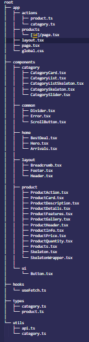

# Winstore E-Commerce Application

A modern e-commerce web application built with **Next.js** and **TypeScript**, featuring a **modular architecture**, **type safety**, **lazy loading**, **skeleton loaders**, **server actions**, and **pixel-perfect UI design**.

---

## Table of Contents

- [Project Overview](#project-overview)  
- [Features](#features)  
- [Folder Structure](#folder-structure)  
- [Architecture](#architecture)  
- [Installation & Running](#installation--running)  
- [Assumptions](#assumptions)  
- [Environment Variables](#environment-variables)  
- [Notes](#notes)
---

## Project Overview

Winstore is a responsive e-commerce application that includes:

- Home page with Hero section, Best Deals, New Arrivals
- Category slider and category list
- Product listing and product details page
- Reusable components (Button, Card, Skeleton Loader)
- Robust error handling with safeFetch utility
- Lazy loading using `React.lazy` and `Suspense`
- Type-safe API calls using TypeScript interfaces
- Memoization for performance optimization
- Pixel-perfect layout based on Figma designs

---

## Features

- **Reusable Components**: Buttons, ProductCard, CategoryCard, etc.  
- **Custom Hook**: `useFetch` for type-safe, reusable data fetching  
- **Skeleton Loader**: Improves UX during data loading  
- **Memoization**: `React.memo` used for optimization  
- **Lazy Loading**: Component-level lazy loading with suspense fallback  
- **Server Actions**: Server-side data updates and fetches  
- **Type Safety**: Interfaces for Product, Category, API responses  
- **Error Handling**: Robust network error handling with fallback UI  


## Folder Structure

Here is the project folder structure:




## Architecture

**Flow of data and rendering:**


- **API Layer**: `utils/api.ts` contains `safeFetch` for type-safe and robust API calls.  
- **Custom Hook**: `useFetch` handles loading, error, and memoized data states.  
- **Components**: Reusable, type-safe components that receive props and optional icons.  
- **UI Layer**: Tailwind-based design for pixel-perfect layout from Figma.  
- **Performance**:  
  - `React.memo` for memoization  
  - `React.lazy` + `Suspense` for lazy loading heavy components  
  - Skeleton loaders for pending fetch states  
- **Server Actions**: `app/actions/*` for server-side fetch/update operations  

---

## Installation & Running

1. **Clone the repo**  
```bash
git clone https://github.com/Nazim777/winstore.git
cd winstore
```
2. **Install dependencies**  
```bash
npm install
# or
yarn install
```

3. **Setup Environment Variables**
#### Copy .env.example to .env.local and update your API endpoints

4. **Run the development server**  
```bash
npm run dev
# or
yarn dev
```

5. **Open in browser**  
```bash
http://localhost:3000
```

## Assumptions

- All data fetching endpoints return a JSON object `{ data: ... }`.
- Skeleton loaders are used for all product and category lists while fetching.
- All components are responsive with Tailwind.
- Server actions are idempotent and follow REST conventions.

## Environment Variables (.env.example)
```bash
NEXT_PUBLIC_BASE_API_URL = api.example.com
```


## Notes

- Pixel-perfect layout is implemented using Figma dimensions.
- Reusable components like `Button` accept `icon`, `text`, `onClick`, `variant`, and `custom color`.
- Lazy loading, suspense, and memoization ensure performance optimization.
- TypeScript enforces type safety across the app.
- Robust error handling ensures the app handles network failures gracefully.
